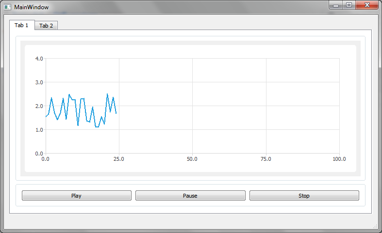
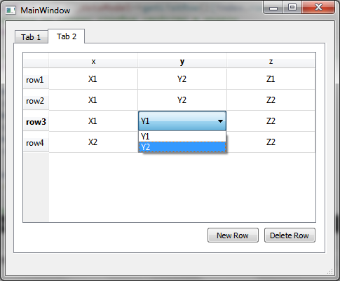

# Qt_exercises-chart_thread_table_introspection
 This repo demonstrates two Qt exercises: 
 - Real-time plotting in a separate thread. It is used QtCharts and reimplemented run of QThread
 
 
 
 - Сreating a table with the introspection. It is used an inheritance from QAbstractTableModel
 
 
